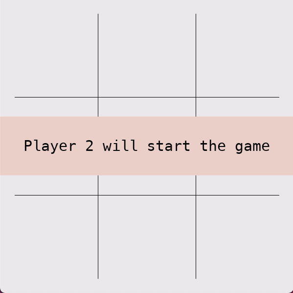
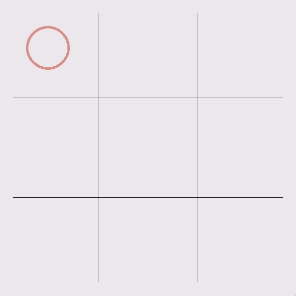
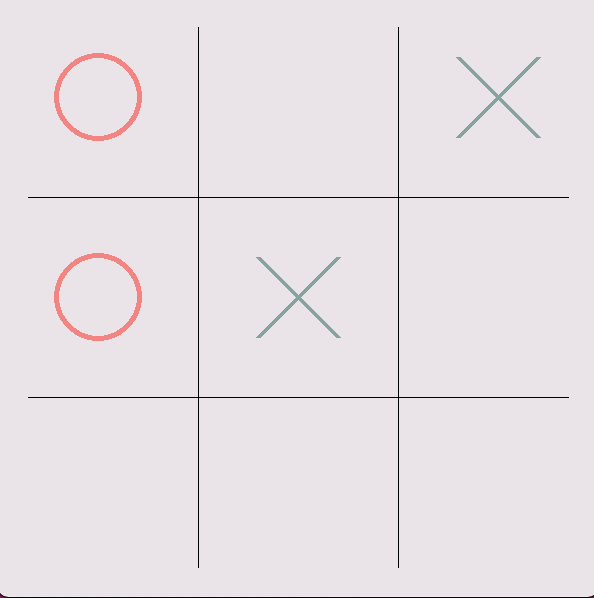
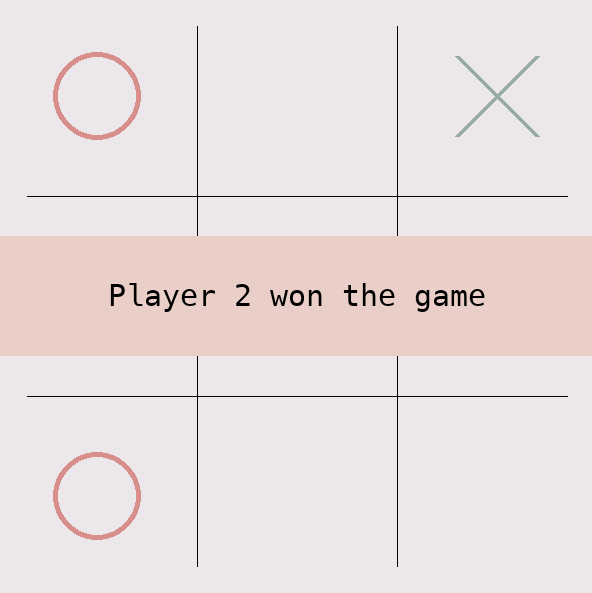
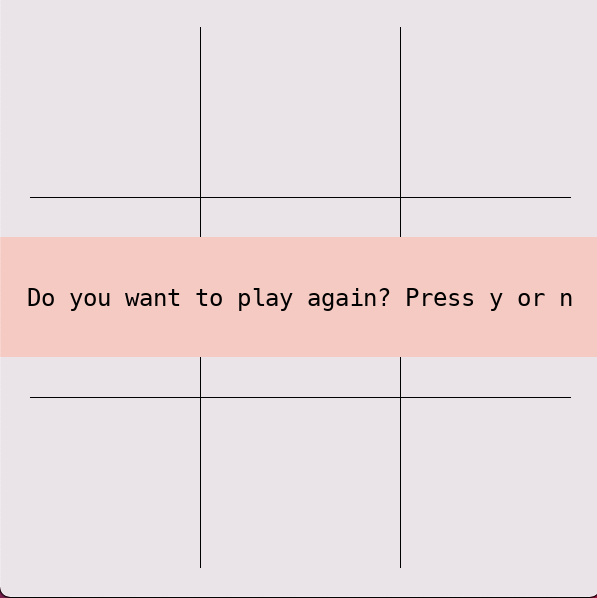
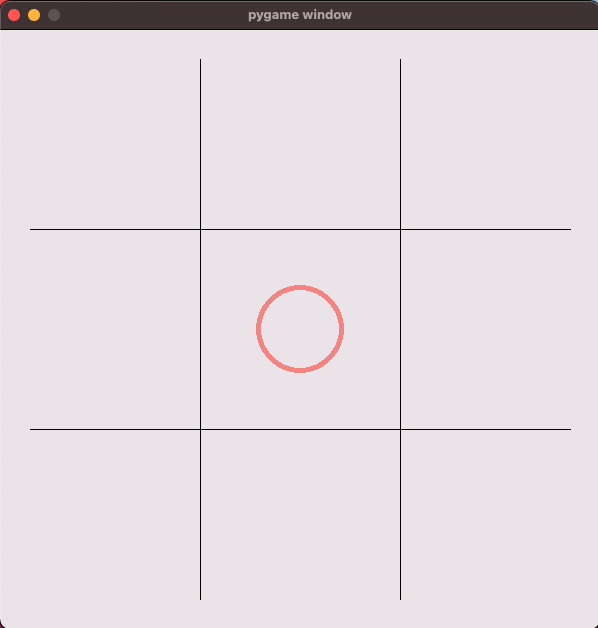

# Tic-Tac-Toe
## Introduction
This is a two player tic tac toe game, which uses the 
terminal interface. The user selects the position where they
want to play their move by typing the row and column.
The game is resolved when a player has 3 unobstructed
moves in one row or column.

### Getting started with the package
To get started clone this repo and ensure you are in teh right folder.
```bash
git clone https://github.com/mwolinska/Tic-Tac-Toe
cd Tic-Tac-Toe
```

Then, simply install all the dependencies using [poetry](https://python-poetry.org).
```bash
poetry install
```

### Using the package
You can either play a single player game (against a bot):
```bash
play_alone
```
or a two player game (black makes the first move):
```bash
play_together
```
An example run would look something like this:
First the game randomly decides who will start the game. 
Player 1  plays using crosses and Player 2 plays using circles.
If you opt to use `play_alone` the bot plays as Player 2.



The user should click to start the game and then a clean board is displayed. 


The first player makes their move (in this case Player 2 - circle) 
by clicking in teh desired location:



The game continues:



When a move is played that leads to an outcome that finishes the game 
i.e. a win or a draw, the outcome is displayed. In this case player 2 made the winning move.



Clicking on the screen will allow the user to decide if they would like to play again.



Pressing the 'Y' key restarts the game, pressing the 'N' key exits the game. 

The user can exit the game at any point by pressing the X button at the top of the window 
or by pressing the Esc key.


